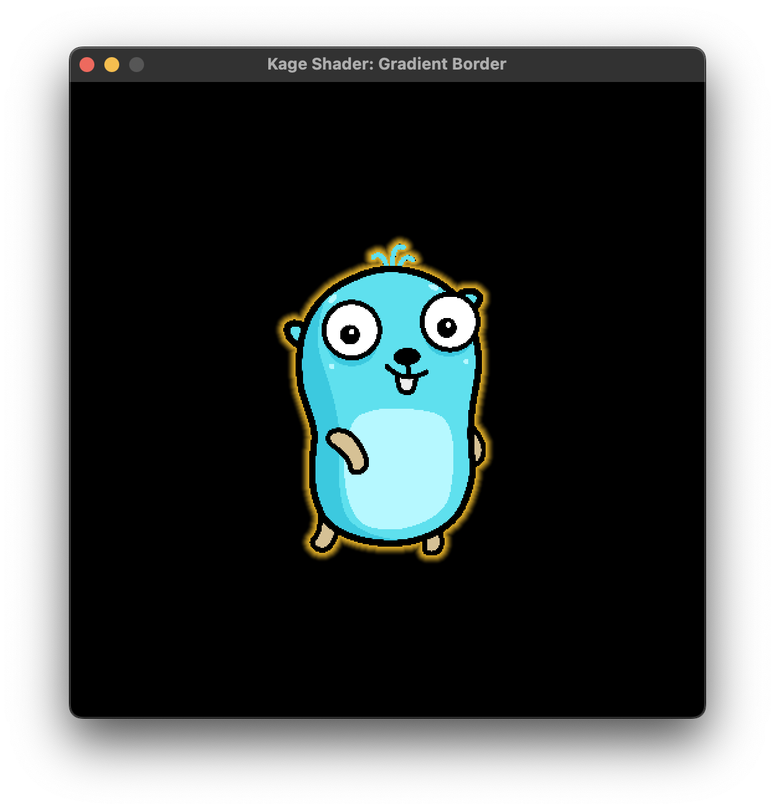

# Gradient Border

This shader creates a gradient border around a sprite.

## Constants

| Constant     | Type    | Description              |
|--------------|---------|--------------------------|
| `BorderSize` | `float` | Size of border in pixels |

## Uniforms

| Uniform        | Type   | Description                                 |
|----------------|--------|---------------------------------------------|
| `BorderColor`  | `vec4` | Colour of the border in R, G, B, A          |
| `BorderEnable` | `int`  | 0 disables border. Any other value enables. |

## Screenshot

## Attribution

* Gopher artwork:
  * [Maria Letta's Free Gophers Pack](https://github.com/MariaLetta/free-gophers-pack)
  * Specifically this one: <https://github.com/MariaLetta/free-gophers-pack/blob/master/characters/png/6.png>